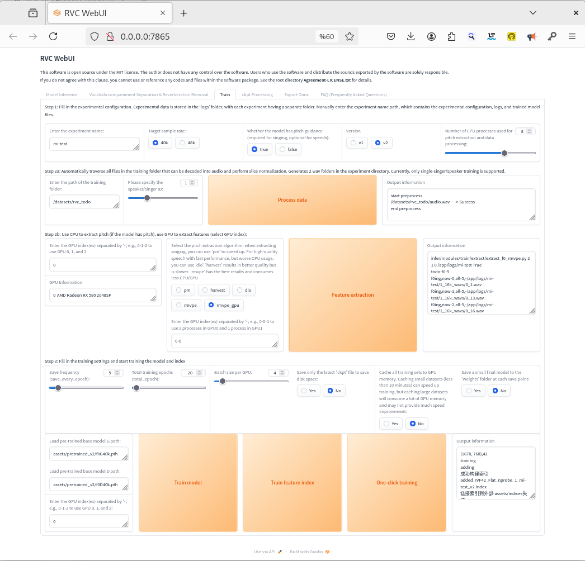
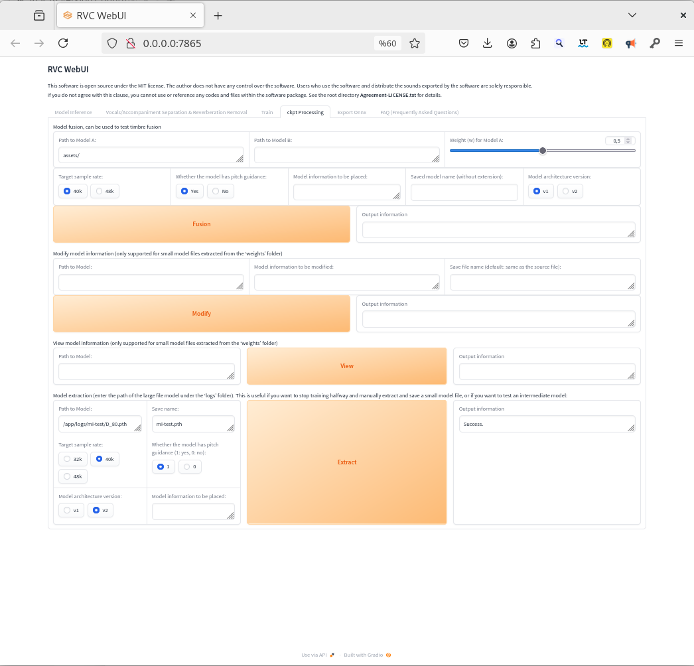
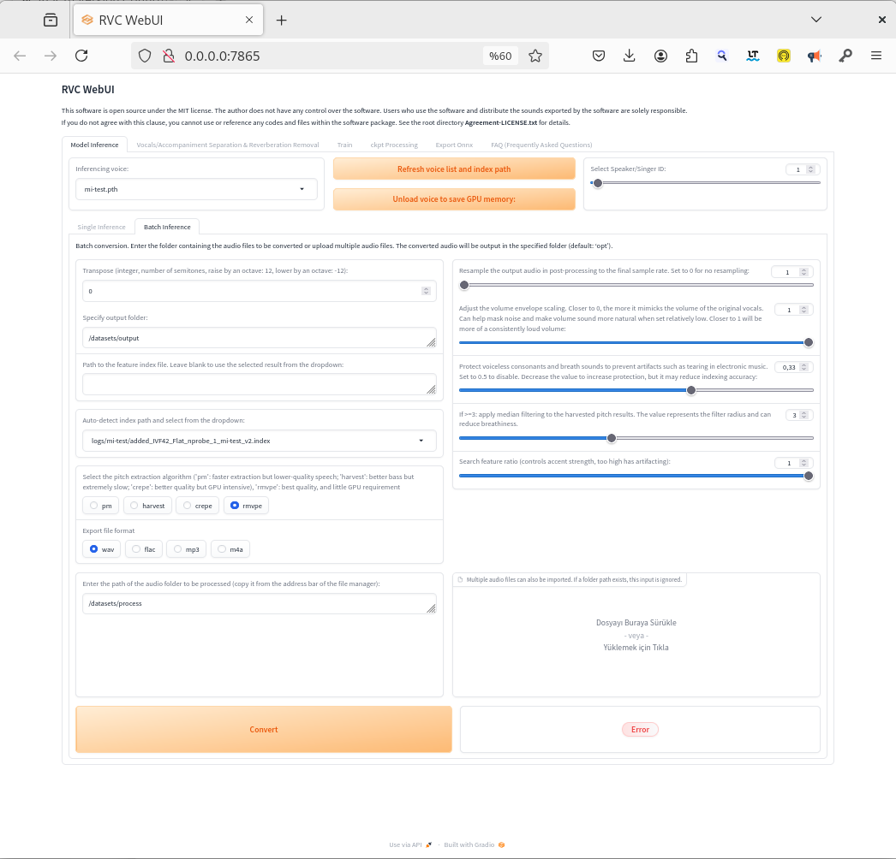

# ROCm 5.4.2 Support for RVC WebUI on gfx803 (AMD RX580 / Polaris GPUs)

**Created and Compiled by Levent Sunay (lsunay) - May 2025**

## Acknowledgments

Before diving into the details, I would like to express my sincere gratitude to **Robert Rosenbusch** for his foundational and exceptional work. Thanks to his efforts, I have been able to run incredible applications on my older GPU, unlocking possibilities I never thought were achievable with legacy hardware. His contributions have been instrumental in making this project a reality. 
 
I also extend my heartfelt thanks to the **RVC-Project Team** for developing the amazing **Retrieval-based-Voice-Conversion-WebUI (RVC)**. Their open-source work has been the cornerstone of this project, enabling voice conversion capabilities on AMD GPUs with ROCm support. You can explore their repository and learn more about their innovative work at [https://github.com/RVC-Project/Retrieval-based-Voice-Conversion-WebUI](https://github.com/RVC-Project/Retrieval-based-Voice-Conversion-WebUI/tree/main).


## Overview

This project provides a Docker-based setup for running the **Retrieval-based-Voice-Conversion-WebUI (RVC)** with **ROCm 5.4.2** support on older AMD GPUs like the **RX580 (gfx803 / Polaris)**. The goal is to enable machine learning workloads, specifically voice conversion, on hardware with limited or discontinued official ROCm support. This repository contains Dockerfiles and scripts to build and run the RVC WebUI, leveraging custom-compiled PyTorch for ROCm compatibility.

This `README.md` summarizes the setup process, shares key experiences and challenges encountered while working with ROCm on older hardware, and provides instructions for building, running, and using the RVC application.

---

## Key Features

- **ROCm 5.4.2 Base Image**: A foundation with ROCm libraries and drivers for gfx803 compatibility.
- **Custom PyTorch Compilation**: PyTorch 2.0.1, TorchVision, and TorchAudio compiled from source for gfx803 architecture.
- **RVC WebUI Installation**: Setup for the original RVC project with necessary dependencies and pre-trained models.
- **Dockerized Environment**: Multi-stage Docker builds to ensure reproducibility and isolation.
- **GPU Recognition**: Successfully tested with `torch.cuda.is_available() == True` and GPU detection in RVC (`AMD Radeon RX 580 2048SP`).

---

## Project Structure

This folder (`rocm_5.4`) contains the following files for setting up RVC with ROCm 5.4.2:

- **Dockerfile.base_rocm5.4_source_compile**: Stage 1 Dockerfile to build the base image with ROCm 5.4.2 and custom-compiled PyTorch.
- **Dockerfile.rvc_original**: Stage 2 Dockerfile to install the RVC WebUI on top of the base image.
- **entrypoint_rvc.sh**: Entrypoint script to activate the virtual environment, check/download pre-trained models, and start the RVC server.

---

## Experiences and Lessons Learned with ROCm on Older Hardware (gfx803)

Working with ROCm on older AMD GPUs like the RX580 (gfx803 / Polaris) presents unique challenges due to limited official support in newer versions. Below are key takeaways and experiences from this project that may help others working on similar setups:

1. **Base Image Selection is Critical**: Start with a compatible ROCm base image (e.g., `rocm/dev-ubuntu-22.04:5.4.2-complete`) that matches the Ubuntu and Python versions required for ROCm. This ensures essential drivers and libraries are correctly installed.
2. **Hardware Support Limitations**: Official ROCm support for gfx803 ends at specific versions (e.g., 5.7 or earlier). Using versions beyond this can lead to compatibility issues, missing kernels, or low-level errors like `invalid device function` or `segfault in libamdhip64.so`.
3. **Official PyTorch ROCm Wheels May Be Misleading**: Wheels from `download.pytorch.org/whl/rocmX.Y` are often optimized for newer architectures and may not support older GPUs. If `torch.cuda.is_available()` returns `True` but runtime errors occur (e.g., `HIP error: invalid device function`), the wheels are likely incompatible.
4. **Source Compilation for PyTorch is Often Necessary**: For older hardware, compiling PyTorch from source with `PYTORCH_ROCM_ARCH=gfx803` ensures the correct kernels are built. While time-consuming, this is the most reliable way to achieve compatibility.
5. **Kernel Version Matters**: The host system's Linux kernel version can affect ROCm driver compatibility, especially with newer ROCm versions. Ensure your kernel matches versions listed as "supported" in ROCm documentation.
6. **C++ and Python Development Headers are Essential**: Source compilation requires tools like `build-essential`, `cmake`, `ninja-build`, and Python development headers (`python3.X-dev`) along with `pkg-config`.
7. **Third-Party Dependency Compilation**: PyTorch and other libraries (e.g., rocBLAS, TorchAudio) may compile additional C/C++ dependencies. Reading `install.sh` scripts and patching with `sed` if needed is common. Packages like `libmsgpack-dev` or `python3-joblib` may be required.
8. **Dependency Conflicts and Version Management**:
   - Conflicts are inevitable when installing multiple libraries (e.g., PyTorch, RVC, Fairseq) due to overlapping dependencies like `torch`, `numpy`, or `gradio`.
   - Using a `constraints.txt` file to pin critical versions (e.g., custom PyTorch wheels) is vital.
   - Cleaning `requirements.txt` files with `sed` to remove conflicting lines (e.g., `torch*`) prevents `pip` from pulling incorrect versions.
   - Installing conflicting extensions or packages in separate `RUN` blocks with `--no-deps` and manually installing dependencies with `-c constraints.txt` helps resolve issues.
9. **Docker Build vs. Runtime Environment**: GPU access is unavailable during `docker build`, so `torch.cuda.is_available()` will return `False`. The real test is during `docker run --device...` when it should return `True`.
10. **Gradio and Pandas Issues**: Version mismatches in libraries like NumPy, Pandas, or Gradio can cause errors (e.g., `numpy.dtype size changed`). Resolve these by finding compatible versions with `pip install`.
11. **Model Files and Volumes**: Ensure model files and caches are downloaded to the correct locations and mounted with `docker run -v ...` to avoid `FileNotFoundError` and issues after container restarts.

These experiences highlight the level of detail and care required when working with ROCm on older hardware. They can guide future projects or troubleshooting efforts.

---

## Retrieval-based-Voice-Conversion-WebUI (RVC) Usage

### What is RVC?

RVC (Retrieval-based-Voice-Conversion-WebUI) is an open-source tool for voice conversion, allowing users to transform audio input into a different voice using pre-trained models. It leverages deep learning frameworks like PyTorch for GPU-accelerated processing and provides a user-friendly web interface via Gradio.

### How to Use RVC WebUI

1. **Access the Interface**: After starting the container (see `docker run` instructions below), open your browser and navigate to `http://localhost:7865` (or the IP/port if running on a remote server).
2. **Load Models**: Ensure pre-trained models are available in the `/app/assets/` directory (handled by the entrypoint script or volume mounts). Select a model in the interface.
3. **Upload Audio**: Upload an audio file or record input directly in the interface.
4. **Convert Voice**: Adjust parameters if needed (e.g., pitch, half-precision settings via `config.py`) and click to process the audio.
5. **Download Result**: Once processed, download the converted audio from the interface.
6. **Training with Custom Data**: To train models with your own datasets, provide the path to your training data in the RVC interface. Ensure the path is a container-internal path mapped via a volume mount (see "File Paths in RVC Interface" below).

### Screenshots of RVC WebUI

To help users visualize the interface, below are placeholders for screenshots. These will be added to demonstrate key features like model selection, audio upload, and conversion output.

- **Screenshot 1**: Model Train Interface (`screenshots/screenshot1.png`)
- 
- **Screenshot 2**: Model Selection & Extract (`screenshots/screenshot2.png`)
- 
- **Screenshot 3**: Audio Conversion Result (`screenshots/screenshot3.png`)
- 

*Note*: Screenshots are not included in this README yet. They will be added in future updates. If you wish to contribute screenshots, please upload them to this repository and update the paths above.

### File Paths in RVC Interface

When using the RVC WebUI to specify paths for training datasets or input audio files, **always use container-internal paths** mapped via volume mounts in your `docker run` command. Docker containers are isolated from the host filesystem, so host paths (e.g., `/home/levent/Downloads/rvc_todo`) will result in `FileNotFoundError` unless explicitly mounted.

**Steps to Use File Paths Correctly**:
1. **Mount Host Directories to Container**: Use the `-v` flag in your `docker run` command to map host directories to container-internal paths. For example:
   - `-v /home/levent/rvc_training_data:/datasets` maps the host directory `/home/levent/rvc_training_data` to `/datasets` inside the container.
2. **Specify Container-Internal Paths in RVC**: In the RVC interface (e.g., "Trainset directory" field), enter the container-internal path. If your dataset is in `/home/levent/rvc_training_data/my_dataset` on the host, use `/datasets/my_dataset` in the RVC interface.
3. **Ensure Host Paths Exist**: Before running the container, create the host directories for volume mounts if they don't exist (e.g., `mkdir -p /home/levent/rvc_training_data`).

**Example Error and Fix**:
- **Error**: Entering a host path like `/home/levent/Downloads/rvc_todo` directly in the RVC interface results in `FileNotFoundError: [Errno 2] No such file or directory`.
- **Fix**: Mount the host directory with `-v /home/levent/Downloads:/mnt/host_downloads` in your `docker run` command, then use `/mnt/host_downloads/rvc_todo` in the RVC interface.

### Note on Errors and Output Tracking

During usage, you may encounter error messages in the web interface even though the outputs are successfully generated. It is recommended to monitor the container logs for detailed information on the process and to confirm the status of output generation. You can view the logs by running the following command:

```bash
docker logs rocm54_rvcwebui
```
---


## Docker Instructions

### Prerequisites

- **Docker**: Ensure Docker is installed on your system.
- **AMD GPU**: An AMD GPU with gfx803 architecture (e.g., RX580 / Polaris). Ensure ROCm-compatible drivers are installed on the host if not using a pre-configured base image.
- **Host Kernel Compatibility**: Verify your Linux kernel version matches ROCm 5.4.2 supported versions to avoid low-level errors.


---

## Detailed Build Process and Entrypoint Logic

### Two-Stage Build Process

This project employs a two-stage Docker build process to ensure a modular and efficient setup for running the Retrieval-based-Voice-Conversion-WebUI (RVC) with ROCm 5.4.2 on older AMD GPUs (gfx803 / Polaris, e.g., RX580).

1. **Stage 1: Building the Base Image with ROCm and PyTorch**
   The first stage focuses on creating a base image with the appropriate operating system (Ubuntu 22.04) and ROCm version (5.4.2). This stage involves compiling PyTorch 2.0.1, TorchVision, and TorchAudio from source to ensure compatibility with the gfx803 architecture. A verification block is included at the end of the compilation process to check and log version information (e.g., Python, PyTorch, ROCm availability). This log output is crucial for debugging and confirming the success of the build. Note that this build process can take several hours due to the source compilation of PyTorch and related libraries. The resulting image size for this stage is approximately **23.3 GB**. The build command for this stage is:
   
   
   ```bash 
   docker build -f rocm_5.4/Dockerfile.base_rocm5.4_source_compile -t rocm542_gfx803_base:5.4.2 .

2. **Stage 2: Building the RVC WebUI Image**
      In the second stage, the base image (`rocm542_gfx803_base:5.4.2`) is used to build the application-specific image for RVC. This stage considers the system dependencies and requirements specific to RVC, installing necessary libraries, cloning the RVC repository, and setting up the Python environment with compatible dependencies. This build process is generally shorter than the first stage, often completing in less time. The resulting image size for this stage is approximately **26.4 GB**. The build command for this stage is:

   
   ```bash 
   docker build -f rocm_5.4/Dockerfile.rvc_original -t rvc_webui_rocm:5.4.2 .

### Entrypoint Logic with `entrypoint_rvc.sh`

The `entrypoint_rvc.sh` script plays a critical role in preparing the container's runtime environment when it is first started. This script is copied into the image during the Stage 2 build and must be located in the same directory as `Dockerfile.rvc_original` to ensure it is included correctly. Its primary functions are:

- **Environment Setup**: Activates the Python virtual environment (located at `/app/.venv`) to ensure the correct Python and dependency versions are used for RVC.
- **Model Download and Verification**: Checks if pre-trained models are present in the `/app/assets` directory (which is typically mounted to a host volume for persistence). If models are not found, it downloads a set of standard models from the Hugging Face repository using `aria2c`. This ensures the container is ready for immediate use. Additional models can be downloaded from the Hugging Face page ([https://huggingface.co/lj1995/VoiceConversionWebUI](https://huggingface.co/lj1995/VoiceConversionWebUI)) and copied to the appropriate host directories mapped via volume mounts (e.g., `/app/assets`, `/app/weights`).
- **Starting the RVC Server**: Launches the RVC WebUI server using `infer-web.py` (or `run.sh` if available) on the specified port (default: 7865), making the web interface accessible.

This script ensures that even if models are not included in the Docker image (to keep the image size small), they are available at runtime through volume mounts or automatic download.

### Running the Docker Container

To run the RVC WebUI container with GPU access and persistent storage for models, weights, logs, and cache data, use the following command:

```bash  
  docker run -d \
  --name rocm54_rvcwebui \
  --device=/dev/kfd --device=/dev/dri --group-add video \
  -e HSA_OVERRIDE_GFX_VERSION=8.0.3 \
  -e PYTORCH_ROCM_ARCH=gfx803 \
  -e RVC_PORT=7865 \
  -p 7865:7865 \
  -v /home/levent/rvc_training_data:/datasets \
  -v /virt-machines/dockerdata/rvc_rocm_data/assets:/app/assets \
  -v /virt-machines/dockerdata/rvc_rocm_data/weights:/app/weights \
  -v /virt-machines/dockerdata/rvc_rocm_data/logs:/app/logs \
  -v /virt-machines/dockerdata/applio_rocm/huggingface_cache:/root/.cache/huggingface \
  -e HUGGINGFACE_HUB_CACHE="/root/.cache/huggingface" \
  -v /virt-machines/dockerdata/applio_rocm/torch_cache:/root/.cache/torch \
  -e TORCH_HOME="/root/.cache/torch" \
  -v /virt-machines/dockerdata/applio_rocm/general_cache:/root/.cache \
  -e XDG_CACHE_HOME="/root/.cache" \
  rvc_webui_rocm:5.4.2
```

#### Explanation of Volume Mounts and Parameters

- **`--device=/dev/kfd` and `--device=/dev/dri`**: Grants the container access to the AMD GPU kernel driver and rendering interface for ROCm support.
- **`--group-add video`**: Adds the container user to the necessary group for GPU access (may already be handled if running as root).
- **`-e HSA_OVERRIDE_GFX_VERSION=8.0.3` and `-e PYTORCH_ROCM_ARCH=gfx803`**: Sets environment variables to ensure ROCm compatibility with gfx803 architecture.
- **`-e RVC_PORT=7865` and `-p 7865:7865`**: Configures and maps the container's port 7865 (default RVC port) to the host's port 7865, allowing access to the web interface at `http://localhost:7865`.
- **`-v /home/levent/rvc_training_data:/datasets`**: Mounts a host directory for training datasets. Use `/datasets/...` paths in the RVC interface for training data.
- **`-v /virt-machines/dockerdata/rvc_rocm_data/assets:/app/assets`**: Mounts a host directory to store pre-trained models persistently. This ensures models are not re-downloaded on container restarts.
- **`-v /virt-machines/dockerdata/rvc_rocm_data/weights:/app/weights`**: Mounts a host directory for RVC weights or processed data, critical for saving trained or processed data across container runs.
- **`-v /virt-machines/dockerdata/rvc_rocm_data/logs:/app/logs`**: Mounts a host directory for RVC logs, useful for debugging and tracking training processes.
- **`-v ...:/root/.cache/...` and `-e ...`**: Mounts and sets environment variables for various cache directories (Hugging Face, Torch, general cache) to persist model downloads and intermediate data on the host, reducing redundant downloads and improving performance.

*Note*: Ensure the host paths for volumes exist before running the container. Create them with `mkdir -p /path/to/host/directory` if needed. Adjust paths in the `docker run` command to match your host system's directory structure.

#### Additional Setup for ROCm on Linux

To use ROCm on Linux, ensure all required drivers are installed as described in the official AMD ROCm documentation (refer to [AMD ROCm Installation Guide](https://docs.amd.com/)). You might also need to set the following environment variables on your host system before running the container (or include them in the `docker run` command as shown above):

export ROCM_PATH=/opt/rocm
export HSA_OVERRIDE_GFX_VERSION=8.0.3

Make sure your user is part of the `render` and `video` groups to access GPU resources:

sudo usermod -aG render $USERNAME
sudo usermod -aG video $USERNAME

*Note*: Replace `$USERNAME` with your actual username on the host system. These commands ensure proper permissions for GPU access, which is essential for ROCm functionality. If running the container as root or with appropriate Docker configurations, these group settings may already be handled.

### Logging Build Errors for Debugging

During the build process, errors may occur due to dependency conflicts, compilation issues, or network problems. To facilitate debugging, it is recommended to redirect build logs to a file for later review. This captures both standard output and error messages. Below is an example command to build the Stage 2 image while saving logs to a file:

  ``` bash
    	docker build -f rocm_5.4/Dockerfile.rvc_original -t rvc_webui_rocm:5.4.2 . 2>&1 | tee build_rvc.log```
```


- **`2>&1`**: Redirects both standard output and standard error to the same stream.
- **`tee build_rvc.log`**: Writes the output to both the terminal and the specified log file (`build_rvc.log`).

Similarly, for Stage 1, you can use:

``` bash  
 	docker build -f rocm_5.4/Dockerfile.base_rocm5.4_source_compile -t rocm542_gfx803_base:5.4.2 . 2>&1 | tee build_base.log
```


Saving logs is especially useful for troubleshooting long builds or identifying specific errors in the compilation or dependency installation steps. After the build, review the log files (`build_base.log` or `build_rvc.log`) to pinpoint issues if the build fails.

**Note on Build Logs**: For those interested in reviewing the build logs for debugging or analysis, the log files for both stages are available as text files. You can access them here:
- [Stage 1 Build Log1](logs/build_rocm542.log)
- [Stage 1 Build Log2](logs/build_rocm542_v1.log)
- [Stage 1 Build Log3](logs/build_rocm542_v2.log)
- [Stage 1 Build Log4](logs/build_rocm542_v3.log)
- [Stage 1 Build Log5](logs/build_rocm542_v4.log)
 
- [Stage 2 Build Log1](logs/build_rvc.log)
- [Stage 2 Build Log2](logs/build_rvc1.log)
- [Stage 2 Build Log3](logs/build_rvc12.log)
- [Stage 2 Build Log4](logs/build_rvc13.log)
- [Stage 2 Build Log5](logs/build_rvc14.log)